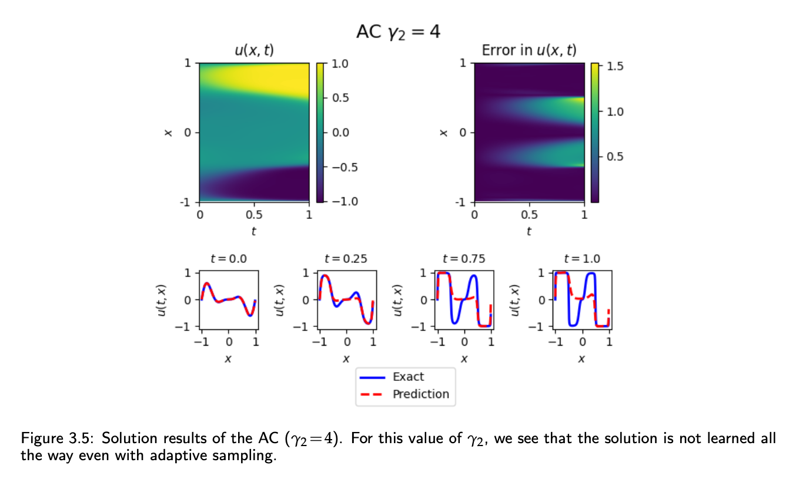

# Allen-Cahn System Equations Simulation


### This is daily-basis working project. The latest results with the improvement from the paper [1] are in the 'AC_1D_gamma2_4' folder as .png graph files and train.py file.
To imporve the result of Fig3.5 in [1], here are the brief descriptions for step-by-step development on the experiment with same conditions on the figure.
- I used new sampling methods and technical engineering strategies to decrease the absolute error for the output of PINN simulation.
- The below is Fig3.5 in [1], which bacame the basic control group result using PINN.
- The .png files in this folder are the improved results as treatment group for the experiments(control group) in Fig 3.5 in [1].

  
## Improvement in each date
**Key point to review improvement** : There are three values mainly.
1. The exact solution from FD simulation(as in 'FD_simulation' file),
2. control group as the basic experiment as the above figure in the paper [1] and
3. treatment group after applying various strategies as below .png files, instead of the loss-adaptive stratigy in [1].

- **basic_eadap2D.png, basic_eadap3D.png** files : This is the result of the energy-adaptive sampling on the control group experiment in the Fig 3.5 in [1](above figure). We applied energy-adaptive spatial domain sampling method on the Fig 3.5 experiment. This is the MCMC(Markov Chain Monte Carlo) sampling method to generate more sampling according to the energy of the AC1D. In these figures, we can see the developed error bound by comparing them with above output u(x,t) error graph.

- **time1_2d.png, time1_3d.png** files : This is the result of the time-exponential sampling on the control group prerequisite experiment as the Fig 3.6 in [1]. The Fig 3.6 experiment uses time-adpative 1 method in the paper with time slices. PINN network gradually trains the 1D AC system from [0, .1] , [0, .2], ... , [0, .9], [0, 1.0] to develop the accuracy. Above this, to compare the accuracy after applying exponential time sampling, I added time exponential sampling which focuses on a lot of sample points around t = 0 with exponential distribution. In these figures, we can see the developed accuracy by comparing with the Fig 3.6 in [1].

- **time1_e_adap2d.png, time1_e_adap3d.png** files : This is the result of new sampling using highlighting the domain of high total energy of Allen-Cahn system. We adjusted the ratio of new sampling and uniform distributed sampling for input variable x to make collocation point number is same with the one of above experiment Figure3.5 in [1].
  
[comment]: # (time-sampling for the t input time variable. I used r = 10 for the next formula.)

### Clone

```bash
git clone https://github.com/woooojng/PINN_Cahn-Hilliard_system.git
```

[comment]: # (%### Create an anaconda environment [Optional]:)


[comment]: # (### Download the pretrained embeddings:)


## Usage

### Train the model at clonned directory in terminal:

```bash
python3 train.py
```

### Show help message and exit:

```bash
python3 train.py -h
```

## File Specifications

- **Building_net.py**: Neural Network Architecture for layer setting and forward step with x, y, t input/ velocity u, pressure P, density rho viscoscity mu output variables.
- **Conditions.py**: For the equations in [1], the equations on left/right wall and top/bottom outer boundary of domain with MSE function are defined. Also, for the Cahn-Hillard PDE equations in [1], MSE loss function associated with governing equations is defined.
- **Train.py**: Neural network training function starting from Initial condition train running and then running for total loss summing with all loss functions.


## Reference

[comment]: # (If this work is helpful, please cite as:)

<a id="1">[1]</a> 
Wight, C. L. & Zhao, J. Solving Allen–Cahn and
Cahn–Hilliard equations using the adaptive physics
informed neural networks. Preprint at arXiv
https://arXiv.org/abs/2007.04542 (2020).


[comment]: # (## Acknowledgments)

[comment]: # (This work is supported partly by the National Natural Science Foundation)

## Contact

wki1 [AT] iu [DOT] edu

[comment]: # (## License)

[comment]: # (MIT)
